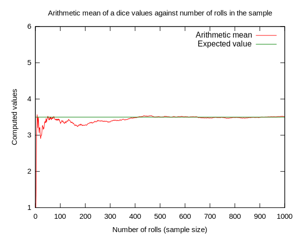

# Lab | Reading About Statistic Concepts

## Introduction

In the future, you will need to understand deep statistical concepts by reading technical articles. As a training for that, it is interesting to start from here. Also, as we have limited time, this is a way to have some self guided learning to understand everything better and have a wider knowledge.

This week you will find some questions here that you will need to answer by documentating yourself. So you will do a different PR for each question (you are meant to answer the questions in different days). Don't hesitate to write as many text as you need and push images if you need them.

Remember for this lab: there is a right answer. But there is no perfect way to explain it (except for in a mathematical way, but this is another story).

## Challenges

### Challenge 1: What is the difference between expected value and mean?
You know both concepts but, is there a difference? Are they synonims? Start investigating. As a good reference (once you have looked for some information) you have   [this](http://expected.news/value2) article.

There is a difference between the expected value and the mean, which is stressed in particular for experiments with a low number of samples. To explain this, we will refer to the experiment of rolling a dice, where the discrete random variable $X$ has a finite number - $n=6$ - of possible outcomes in the set $\Omega=\{i\}$, for $i=1,2,...,6$. The expected value $E[X]$ is an average of the possible outcomes - $x_i$ - weighted by their probability of occurrance $p_i$, in mathematical terms:

$\displaystyle{E} [X]=\sum _{i=1}^{k}x_{i}\,p_{i}$.

In our example of a "fair" dice, we have that all probabilities $\displaystyle p_i=\frac{1}{6}$ are the same $\forall i$ therefore the expected value results:

$\displaystyle{E} [X]=\frac{1}{6}\sum _{i=1}^{k}x_{i}=\frac{1}{6}\left(1+2+3+4+5+6\right)=3.5$ .

This number (3.5) - the expected value of rolling a dice - is not necessarily the resulting arithmetic mean of an experiment sample when the number of independent realizations is low. However, the arithmetic mean of the sample will tend to the expected value as long as the independent number of realizations become large. This effect is very well illustrated for a dice roll experiment in the Figure below (modified from source: NYKevin, wikipedia).

<!-- the convergence of the sample arithmetic mean to the expected value of 3.5

An illustration of the convergence of sequence averages of rolls of a die to the expected value of 3.5 as the number of rolls (trials) grows.
 -->

### Challenge 2: What is the "problem" in science with p-values?
We have told you that a lot of scientifical investigations are based on p-values. The last week, Nature magazine published [an article](http://nature.social/statistical4) regarding the problem. Start digging on it! Don't hesitate to use more articles if you want to :)

The authors in [this article](http://nature.social/statistical4) suggest to stop using statistical significance (or p-values) as the basis to affirm that there is *no association* with a certain phenomenon or to conclude that studies are *in contrast* between each other.

Alternatively, the authors claim we should stop categorizing results as different when they fall into a *statistically significant* or a *non-significant* buckets. Instead, the authors claim we should rename the confidence intervals and interpret them as intervals containing values that are more compatible with our data, given the assumptions used to compute such intervals. This implies embracing uncertainty, that is, accept that the computed compatibility intervals are based on the correctness of the statistical assumptions, which in practice are subjected to considerable uncertainty.

To sum up, the claim stands up for a change where studies do not report only significance tests as binary inequalities (e.g. P  < 0.05 or P > 0.05) but instead, they emphasize the practical implications of all the values falling inside a compatibility interval. In this sense, the observed effect - or point estimate – should be explicitly discussed together with its uncertainty, which is the lower and upper limits of their intervals.

### Challenge 3: Applying testing to a specific case: A/B testing.
A/B testing is a widely used tool to understand differences between two samples. It is a way to measure the impact of something we did: 
* A marketing campaign.
* A new feature in our application. 
* A new design in our application.
* A different flow in the User Experience flow.

To do this, is very important first to design our experiment. 
* We need to know how we are measuring the impact. If people has the behaviour we want with this new implementation.
* We choose a control group (people who doesn't have/see the new change) and the group which will see the new change. 
* We think about how much data do we need.
* We measure the difference between them.

One example:
Our application has a lot of mini-games. We want people to reach the games that we think are the best but the behaviour is not the expected, they don't reach them.

So we call a designer and after a lot of work he shows us a new design for our application: we will add a botton specific for that kind of games inviting the users to click on it:

*Click here to discover cool games!*

We think it will work but can we be sure? So instead of implementing this new botton for all users, we implement it for 10% and we compare the results with the users that didn't have it. Is there a significant difference? Is our botton working?

Read more about A/B testing with a couple of examples:

[Another example about Netflix here](http://select.video/artwork4)

[What happened to Basecamp](http://millions.social/tested7)

[An example with Python](http://math.social/tested3)

[A cool general explanation](http://arts.show/tested7)

So, take one single example in the articles you just read, which specific test/s would you apply? (We want you just to do a draft and think a little bit how to apply the tests you already know in this case).

This first question to address in the present case is to asses if the 10% could result in a very skewed split towards the people that would actually see the changes. This would lead to longer times of data collection before the A/B testing becomes statistically significant.

Then, we would collect the data of our analysis, which would be the number of users sessions coming to our website, split between those that have seen/haven’t seen the change in the implemented button. For these two groups, we would also collect the conversion rates, which is the percentage of people that have actually reached the games we are aiming.

With the collected data, we would conduct an A/B testing to assess if the conversion rates obtained in the new website are significant to justify the changes. We would consider a chi-squared ($\chi^2$) test to compare appropriately the conversion rates, given these outcomes are binomially (True/False) distributed.

A detailed procedure explained for the chi-squared test applied to conversion rates and its implementation in Python could be find [in this article](http://arts.show/tested7).

## Deliverables
You need to submit a markdown file with the answers to the questions above. You can create a new `.md` file or directly edit the `README.md`.

## Submission
Upon completion, add your deliverables to git. Then commit git and push your branch to the remote.
